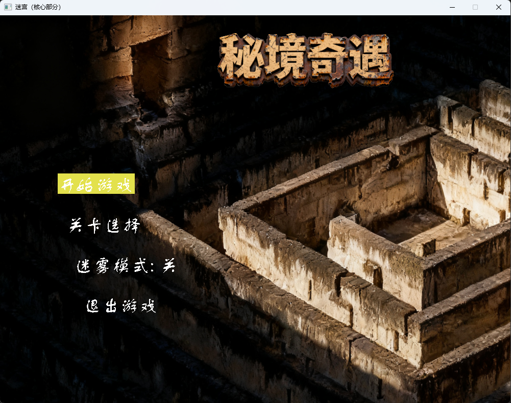
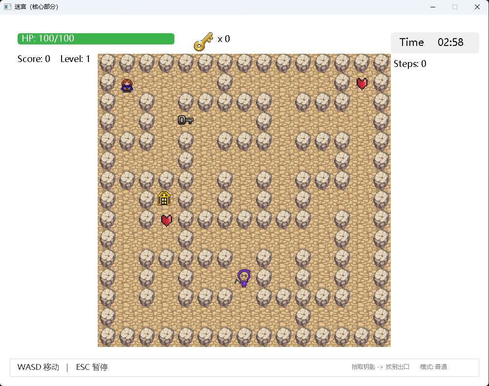

# 秘境奇遇 — 迷宫探险家

基于 **C++** 和 **EasyX** 图形库开发的 Windows 端迷宫探险游戏。玩家在随机生成的迷宫中收集钥匙、躲避敌人、找到出口，逐步挑战三个难度递增的关卡。

---

## 游戏截图




---

## 核心玩法

- **随机迷宫生成**：采用 DFS（深度优先搜索）算法生成每次都不一样的迷宫地图
- **三层渐进式难度**：从简单到困难,敌人数量、移动速度、时间限制和道具数量逐步升级
- **迷雾模式**：开启后仅显示玩家周围 2 格范围,其余区域被迷雾覆盖,大幅提升探索感
- **道具收集**：拾取钥匙解锁出口、收集血包恢复生命值
- **暂停功能**：按 `ESC` 随时暂停/继续游戏
- **最佳记录**：每关单独记录最佳得分和最佳通关时间

---

## 操作说明

| 按键 | 功能 |
|------|------|
| `W` `A` `S` `D` | 控制角色上下左右移动 |
| `ESC` | 暂停 / 继续游戏 |
| 鼠标点击 | 菜单和关卡选择界面交互 |

---

## 关卡设计

| 关卡 | 难度 | 敌人数量 | 时间限制 | 钥匙需求 | 血包数量 |
|------|------|----------|----------|----------|----------|
| 第 1 关 | 简单 | 1 | 180 秒 | 1 | 2 |
| 第 2 关 | 普通 | 2 | 210 秒 | 2 | 2 |
| 第 3 关 | 困难 | 3 | 240 秒 | 2 | 1 |

必须依次通关才能解锁下一关。

---

## 技术实现

### 开发环境

- **语言**：C++
- **图形库**：[EasyX](https://easyx.cn/)
- **编译器**：Visual Studio 2022 (v143 工具集)
- **平台**：Windows（x64 / x86）

### 核心算法

- **迷宫生成** — 随机 DFS 回溯算法,起于 (1,1)，每次随机打乱方向,按关卡复杂度控制分支数
- **出口定位** — BFS 遍历迷宫,将出口设置于距离起点最远的可达位置（最小距离 ≥ 8）
- **道具放置** — 随机分布钥匙和血包,确保道具之间以及与起点/出口不重叠
- **迷雾渲染** — 根据玩家坐标判断格子可视性,不可视区域叠加半透明迷雾图层

### 架构设计

采用**状态机模式**管理游戏流程,包含 6 种状态：

```
MENU → LEVEL_SELECT → PLAYING ↔ GAME_OVER
                        ↓
                  LEVEL_COMPLETE
                        ↓
                    EXIT_GAME
```

### 技术要点

- 60 FPS 帧率控制,双缓冲渲染（`BeginBatchDraw` / `EndBatchDraw`）
- MCI（Media Control Interface）实现背景音乐和音效播放
- 带延迟的按键长按连发处理

---

## 项目结构

```
迷宫_含迷雾/
├── 迷宫（核心部分）.cpp     # 主程序源代码（约 2500 行）
├── 迷宫（核心部分）.sln     # Visual Studio 解决方案
├── 迷宫（核心部分）.vcxproj # VS 项目文件
└── assets/                  # 游戏资源
    ├── wall.png             # 墙壁贴图
    ├── path.jpg             # 路径贴图
    ├── player_*.png         # 玩家四方向贴图
    ├── enemy.png            # 敌人贴图
    ├── key_hs.png           # 钥匙贴图
    ├── heart.png            # 血包贴图
    ├── door.png             # 出口贴图
    ├── fog.png              # 迷雾遮罩
    ├── menubackground.png   # 菜单背景
    ├── gametitle.png        # 游戏标题
    ├── select_background.jpg# 关卡选择背景
    ├── feather.png          # 简单关卡图标（羽毛）
    ├── sword.png            # 普通关卡图标（剑）
    ├── skull.png            # 困难关卡图标（骷髅）
    ├── *.wav / *.mp3        # 音效和背景音乐
    ├── LevelUp/             # 升级动画帧序列
    └── YouWin/              # 通关动画帧序列
```

---

## 构建与运行

1. 安装 [Visual Studio 2022](https://visualstudio.microsoft.com/) （社区版即可）
2. 安装 [EasyX 图形库](https://easyx.cn/)
3. 打开 `迷宫（核心部分）.sln`
4. 选择 **Debug x64** 配置,点击运行（F5）

> 确保 `assets/` 文件夹与编译输出的 `.exe` 位于同一目录下。

---

## 开发团队

**bug终结者**

| 模块 | 负责人 |
|------|--------|
| 程序主入口、玩家移动 & 输入 | Ricardoo |
| 游戏逻辑 & 状态管理 | 浮生如梦 |
| 迷宫生成 & 道具放置 & 出口定位 | HFSCR7 |
| 敌人 AI | christa |
| 游戏资源加载 & 渲染（含迷雾） | 花伞 |
| 游戏结束 & 资源释放 | chen |
| 菜单 & 关卡选择 & 通关界面 | wzf |
| 初始化 & UI 渲染 & 全局架构 | 我菜我多练 |

---

## 许可证

本项目仅用于学习和交流目的。
